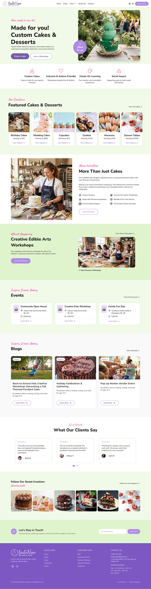

# tasteNsee Cakes & Desserts

A responsive, multi-page website for **tasteNsee**, a Calgary-based custom cake and dessert studio. The site presents handcrafted cakes, dessert tables, and inclusive creative edible-arts workshops for children of all abilities.



## About the website

tasteNsee brings together thoughtful cake design, premium ingredients, and a passion for making celebrations memorable. The website introduces the baker's story, showcases custom creations, promotes workshops and events, and helps customers request quotes or get in touch.

## Pages

- **Home** — featured cakes and desserts, workshops, events, blog highlights, testimonials, and newsletter signup
- **About** — the founder's journey from registered nurse to certified cake designer, along with the studio's values and services
- **Gallery** — a filterable collection of wedding cakes, birthday cakes, character cakes, cupcakes, cookies, macarons, and dessert tables
- **Gallery Details** — a closer look at a featured cake, including its design story and creative process
- **Consultation** — a detailed custom-cake quote request form with inspiration-image upload
- **Events & Workshops** — upcoming classes and events, workshop values, and private group bookings
- **Blog** — featured stories, cake tips, workshop recaps, seasonal updates, and category browsing
- **Blog Article** — a long-form journal story with an article outline, related posts, sharing, and newsletter signup
- **Workshop Registration** — registration for inclusive children's creative baking workshops
- **Contact** — contact information and a general enquiry form

## Features

- Responsive layouts for desktop, tablet, and mobile
- Accessible navigation, form labels, and interactive controls
- Sticky header with mobile navigation and dropdown menu
- Filterable cake gallery
- Testimonial carousel on smaller screens
- Expandable FAQ sections
- Client-side form validation and feedback
- Reduced-motion support

> The forms currently provide front-end validation and confirmation messages only. Connect them to a form service or backend before using the site in production.

## Built with

- Semantic HTML5
- Modern CSS with custom properties and responsive media queries
- Vanilla JavaScript
- Google Fonts
- Remix Icon

## Run locally

No build step or package installation is required. Clone the repository and serve the project folder with any static web server:

```bash
git clone https://github.com/odedahay/tasteNsee-web-static.git
cd tasteNsee-web-static
python3 -m http.server 8000
```

Then open [http://localhost:8000](http://localhost:8000) in your browser.

## Project structure

```text
.
├── assets/                     # Images, logos, icons, and favicons
├── scripts/script.js           # Navigation, gallery, forms, and UI interactions
├── about.html
├── consultation.html
├── contact.html
├── gallery-details.html
├── gallery.html
├── index.html
├── blog.html
├── blog-details.html
├── workshops-events.html
├── workshop-registration.html
└── styles.css                  # Shared site styles and responsive layouts
```
